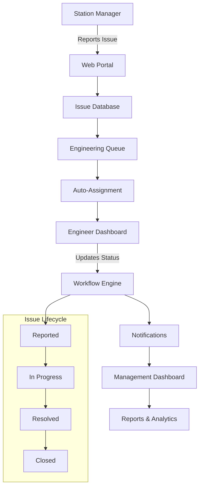

# COCO Station Issue Tracking - Visual Workflow Diagram

## System Overview Diagram



## Detailed Process Flow

```mermaid
flowchart LR
    subgraph "Station Level"
        A1[Station Manager<br/>Identifies Issue] 
        A2[Access Web Portal]
        A3[Fill Issue Form<br/>• Station Name<br/>• Issue Type<br/>• Description<br/>• Photo Upload]
        A4[Submit Issue]
    end
    
    subgraph "System Processing"
        B1[Generate Issue ID]
        B2[Store in Database]
        B3[Auto-assign to<br/>Engineering Queue]
        B4[Send Notifications]
    end
    
    subgraph "Engineering Response"
        C1[Engineer Reviews<br/>Issue Dashboard]
        C2[Accept Assignment]
        C3[Update Status:<br/>'In Progress']
        C4[Work on Resolution]
        C5[Update Status:<br/>'Resolved']
    end
    
    subgraph "Closure Process"
        D1[Station Manager<br/>Confirmation]
        D2[Mark as 'Closed']
        D3[Archive Issue]
        D4[Update Analytics]
    end
    
    A1 --> A2 --> A3 --> A4
    A4 --> B1 --> B2 --> B3 --> B4
    B4 --> C1 --> C2 --> C3 --> C4 --> C5
    C5 --> D1 --> D2 --> D3 --> D4
```



## User Interface Mockup Structure

```
┌─────────────────────────────────────────────────────────┐
│                COCO Issue Tracker                       │
├─────────────────────────────────────────────────────────┤
│  [Station Manager View]                                 │
│                                                         │
│  📍 Station Name: [Dropdown ▼]                         │
│  🔧 Issue Type:   [Dropdown ▼]                         │
│  📝 Description:  [Text Area                          ] │
│                   [                                   ] │
│  📷 Photo:        [Choose File] [Upload]               │
│                                                         │
│  [Submit Issue] [Clear Form]                           │
│                                                         │
│  Recent Issues:                                         │
│  • Issue #001 - Power Outage - In Progress             │
│  • Issue #002 - Pump Failure - Resolved               │
└─────────────────────────────────────────────────────────┘

┌─────────────────────────────────────────────────────────┐
│               Engineering Dashboard                      │
├─────────────────────────────────────────────────────────┤
│  [Engineer View]                                        │
│                                                         │
│  📊 Queue Status: 5 New | 12 In Progress | 3 Resolved │
│                                                         │
│  New Issues:                                           │
│  ┌─────────────────────────────────────────────────────┐│
│  │ #003 | Station A | Electrical | High Priority      ││
│  │ "Generator not starting..." [View] [Accept]         ││
│  └─────────────────────────────────────────────────────┘│
│                                                         │
│  My Assigned Issues:                                   │
│  ┌─────────────────────────────────────────────────────┐│
│  │ #001 | Station B | Mechanical | In Progress         ││
│  │ [Update Status ▼] [Add Notes] [Upload Photo]        ││
│  └─────────────────────────────────────────────────────┘│
└─────────────────────────────────────────────────────────┘
```

This comprehensive document package demonstrates:
- ✅ Complete requirement understanding
- ✅ Technical architecture planning
- ✅ Clear implementation roadmap
- ✅ Professional project management approach
- ✅ Active development status